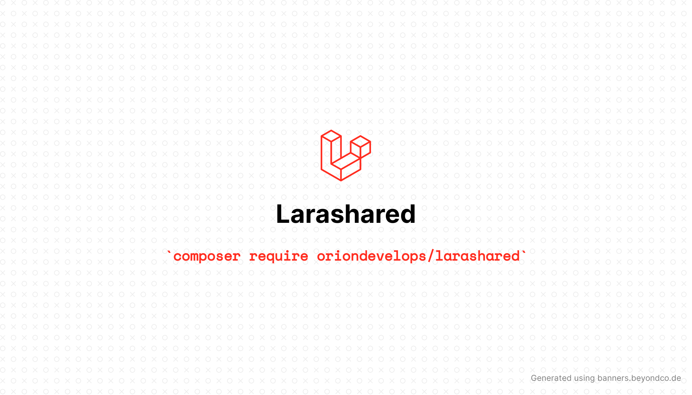

---
# Larashared

[](https://packagist.org/packages/oriondevelops/larashared)
[](https://packagist.org/packages/oriondevelops/larashared)

#### Shared Hosting Deployment Management for Laravel

Larashared is a deployment guide and a helper api in shared hosting environments where ssh access is not available.

It allows using basic Artisan commands through an API by sending post requests with a bearer token for authorization. The package can be installed via composer and the configuration file can be published to modify the API path and the token. The package has several endpoints for different Artisan commands like optimizing, enabling/disabling maintenance mode, cache operations, etc.

## Disclaimer

Deploying Laravel on shared hosting is not recommended. Check out this article by Pardeep Kumar:

[Here’s Why You Should Stay Away From Laravel Shared Hosting](https://www.cloudways.com/blog/stay-away-from-laravel-shared-hosting/)

## Support me

[](https://www.buymeacoffee.com/oriondevelops)  
or send your love & energy <3

## Installation

You can install the package via composer:

```bash
composer require oriondevelops/larashared
```

You can publish the config file with:

```bash
php artisan vendor:publish --tag="larashared-config"
```

This is the contents of the published config file:

```php
return [
    /*
    |--------------------------------------------------------------------------
    | API Path
    |--------------------------------------------------------------------------
    |
    | This is the URI path where API will be accessible from. Feel free to
    | change this path to anything you like.
    |
    */
    'path' => env('LARASHARED_PATH', 'larashared'),

    /*
    |--------------------------------------------------------------------------
    | Token
    |--------------------------------------------------------------------------
    |
    | This value is the token the API will be accessible with.
    |
    */
    'token' => env('LARASHARED_TOKEN', '1|gnmyXCnxxN23MAMxx2dCv5BgT4cUOo6ZWSdUPqWT'),
];
```

## Deployment

* Make a fresh copy of your application 🎁


* Build your production assets 🔧  

  ```bash
  # For example
  npm install
  
  npm run build
  ```
  
* Install dependencies excluding dev packages ↙️

    ```bash
    composer install --optimize-autoloader --no-dev
    ```

   ```bash
    npm install --omit=dev
    ```
  
* Create the .env and fill it according to your shared hosting settings and add `LARASHARED_TOKEN` to your .env file 🔁


* You can now copy the default htaccess file and set a random token by
  the `larashared:install` Artisan command ⚙️

  ```bash
  php artisan larashared:install
  ```
  
* Move your application with all files and folders to your root folder by FTP 🚀


* (Optional) Run your migrations using [migration endpoint](#migrate) ↗️

## Usage

### Authorization

```
Authorization: Bearer <<Your Token>>
```

You can now send post requests to the endpoints using your token.

`POST /larashared/optimize`

```php
<?php
$client = new Client();
$request = new Request('POST', 'https://example.com/larashared/optimize');
$res = $client->sendAsync($request)->wait();
echo $res->getBody();
```

### Response

```json
{
  "success": true,
  "data": "Success",
  "message": "Command successful."
}
```

### API Endpoints
| HTTP Verbs | Endpoints                    | Action                                | Parameters                     |
|------------|------------------------------|---------------------------------------|--------------------------------|
| POST       | /larashared/optimize         | Run artisan optimize command          |                                |
| POST       | /larashared/optimize/clear   | Run artisan optimize:clear command    |                                |
| POST       | /larashared/maintenance      | Enable or disable maintenance mode    | status, secret, refresh, retry |
| POST       | /larashared/config/cache     | Run artisan config:cache command      |                                |
| POST       | /larashared/config/clear     | Run artisan config:clear command      |                                |
| POST       | /larashared/route/cache      | Run artisan route:cache command       |                                |
| POST       | /larashared/route/clear      | Run artisan route:clear command       |                                |
| POST       | /larashared/view/cache       | Run artisan view:cache command        |                                |
| POST       | /larashared/view/clear       | Run artisan view:clear command        |                                |
| POST       | /larashared/migrate          | Run artisan migrate command           | seed, force, pretend, step     |
| POST       | /larashared/migrate/fresh    | Run artisan migrate:fresh command     |                                |
| POST       | /larashared/migrate/refresh  | Run artisan migrate:refresh command   |                                |
| POST       | /larashared/migrate/rollback | Run artisan migrate:rollback command  |                                |
| POST       | /larashared/migrate/reset    | Run artisan migrate:reset command     |                                |
| POST       | /larashared/seed             | Run artisan db:seed command           | class, force                   |

### Maintenance Mode

#### Form Data

`status` `secret` `refresh` `retry`  

Status should be "up" or "down", it will be down if not specified.

Others are the same options of the artisan command. More information can be found at [Laravel Docs.](https://laravel.com/docs/9.x/configuration#maintenance-mode)

To be able to use the api in maintenance mode, do not forget to update following middleware.

```php
    // app/http/middleware/PreventRequestsDuringMaintenance.php
    /**
     * The URIs that should be reachable while maintenance mode is enabled.
     *
     * @var array<int, string>
     */
    protected $except = [
        'larashared/*'
    ];
```

### Migrate

`POST /larashared/migrate`  
`POST /larashared/migrate/fresh`  
`POST /larashared/migrate/refresh`  
`POST /larashared/migrate/rollback`  
`POST /larashared/migrate/reset`

#### Form Data

`seed` `force` `pretend` `step`

### Seed

`POST /larashared/seed`

#### Form Data

`class` `force`

Optionally seeder class can be specified by class parameter.

If you plan to seed your application, make sure dev dependencies like `fakerphp/faker` are installed.

## Credits

- [Mücahit Uğur](https://mucahitugur.com)

## License

The MIT License (MIT). Please see [License File](LICENSE.md) for more information.